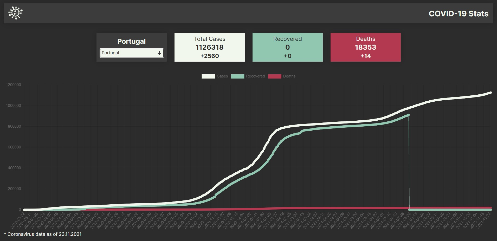

# Covid-19 Stats

Website that shows real-time statistics on Coronavirus cases in chosen country.

- no frameworks used
- displays statistics for user's country on initial load
- user can choose a country from a list
- shows total cases, recovered and deaths
- uses chart.js
- desktop & mobile version

[LIVE VERSION](https://kmkukla.github.io/covid-19-stats/dist/)

Desktop Preview:

Mobile Preview:

## Credits

https://covid19api.com/

https://ipapi.co/
